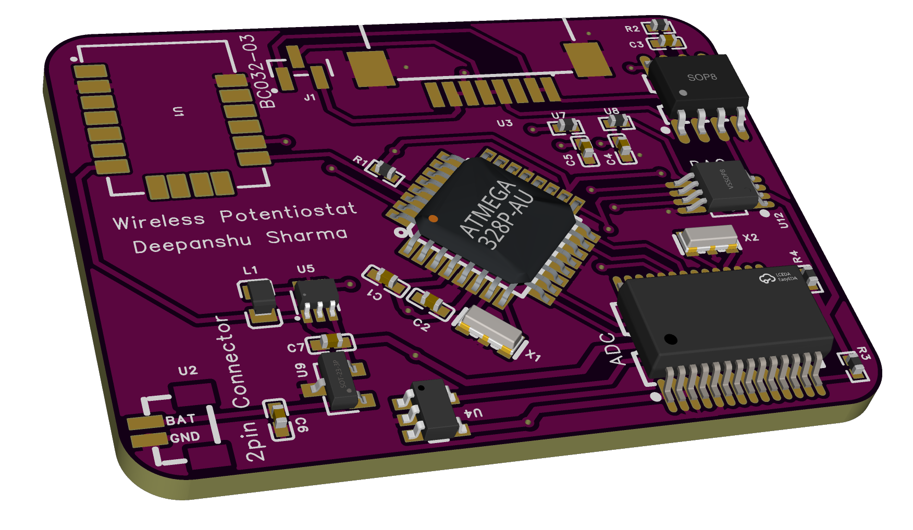
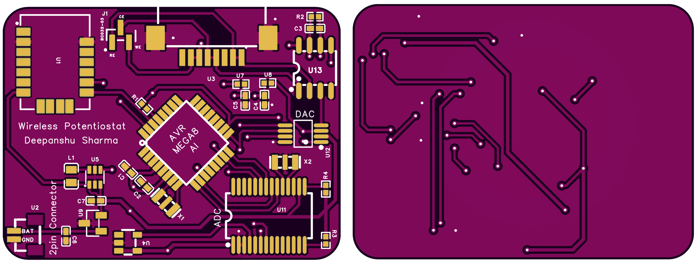
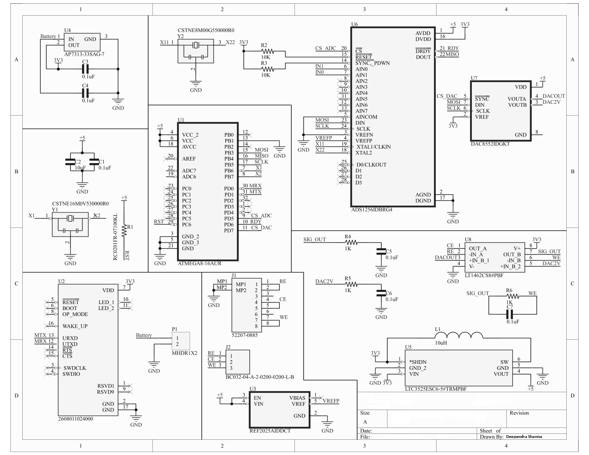

# DeepStat: A Wireless Potentiostat Framework for Electrochemical Biosensing

## Overview
DeepStat is a wireless potentiostat framework designed for electrochemical biosensing applications. It enables precise control of voltage and current in electrochemical cells, making it suitable for experiments such as cyclic voltammetry, amperometry, and impedance spectroscopy. The system is built around a microcontroller and includes wireless communication capabilities for remote data acquisition and control.

## Key Features
- **Wireless Communication**: Enables remote control and data logging.
- **Precision Measurement**: High-resolution ADC and DAC for accurate voltage and current measurements.
- **Electrochemical Cell Control**: Supports working electrode (WE), reference electrode (RE), and counter electrode (CE) connections.
- **Data Logging**: Stores experimental data on an SD card for later analysis.
- **User Interface**: Includes an LCD for real-time data display and buttons for user input.

### PCB Design

### Schematic Diagram

## Schematic
The circuit schematic for DeepStat is shown below. It includes the following key components:
- **Microcontroller**: ATMEGA8-16AUR
- **ADC**: ADS1256IDBRG4 (24-bit precision)
- **DAC**: DAC8552IDGKT (16-bit precision)
- **Operational Amplifiers**: LT1462CS8 for signal conditioning
- **Power Supply**: LTC3525ESC6-5 for voltage regulation
- **Wireless Module**: ESP8266 or similar for wireless communication

## Cite
© Sharma, Deepanshu (2025), Germany.
